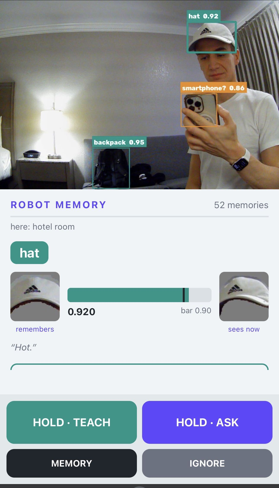
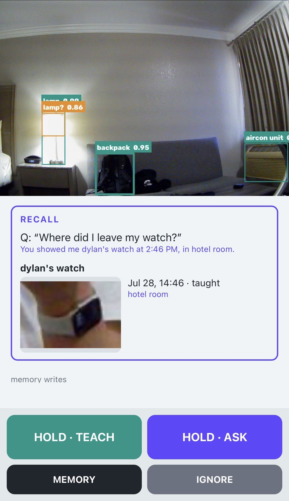
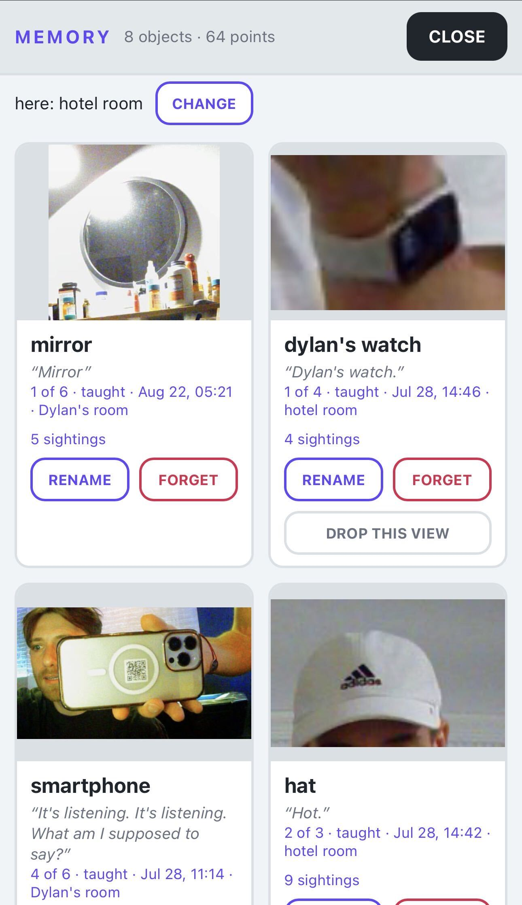
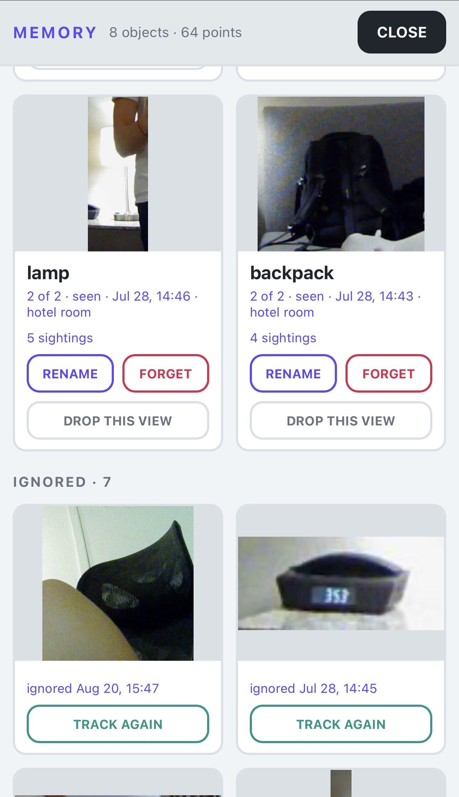

# Short Course: Building on-device AI memory in partnership with Qdrant

# Qdrant Edge Memory Robot


The Qdrant Edge Memory Robot sees an object, learns its name from your voice, and remembers where it saw it. Detection, speech recognition, embeddings, and vector search all run on the device. It needs no cloud service, API key, or large language model.

This project is the physical continuation of the DeepLearning.AI short course [Building On-Device AI Memory with Qdrant Edge](https://github.com/Dylancouzon/SC-Qdrant-C3). The course builds the memory layer in notebooks. This repository connects that layer to a camera, microphone, object detector, and browser interface.

## Start Here

You do not need to print the enclosure or own a Jetson to explore the code.

| Goal | Guide |
|---|---|
| Run the robot with a computer and webcam | [Get Started](docs/getting-started.md) |
| Check the hardware requirements for the complete robot | [Hardware](docs/hardware-parts.md) |
| Build the complete Jetson robot | [Build Your Own Robot](docs/build.md) |
| Connect the course concepts to the implementation | [Understand the Architecture](docs/architecture.md) |
| Find a specific setup or reference page | [Browse the Documentation](docs/README.md) |

## What the Robot Does

- Hold **TEACH** and say, "This is my chair." The robot stores the object, its name, and the current place and time.
- Show the object again. The robot recognizes it and saves a sighting.
- Open **MEMORY** to review, rename, or forget objects and individual views.
- Hold **ASK** and ask, "When did you last see my chair?"

<table>
  <tr>
    <td width="50%" align="center" valign="top">
      <br>
      <sub><strong>Recognize objects</strong></sub>
    </td>
    <td width="50%" align="center" valign="top">
      <br>
      <sub><strong>Recall sightings</strong></sub>
    </td>
  </tr>
  <tr>
    <td width="50%" align="center" valign="top">
      <br>
      <sub><strong>Browse memories</strong></sub>
    </td>
    <td width="50%" align="center" valign="top">
      <br>
      <sub><strong>Manage memories</strong></sub>
    </td>
  </tr>
</table>

## Quick Start

You need Windows, macOS, or Linux, Python 3.12 or newer, [uv](https://docs.astral.sh/uv/), a webcam, and a microphone. Windows support targets 64-bit Windows on x86 processors.

```bash
uv sync
cp .env.example .env
uv run python -m robot.app
```

On Windows PowerShell, replace the copy command with:

```powershell
Copy-Item .env.example .env
```

Open `http://127.0.0.1:8765`. The first run downloads about 1.5 GB of model files and takes longer than later starts.

For the first interaction, hold an object near the center of the camera view. When its box becomes steady, hold **TEACH**, say "This is my object," and release the button. See [Get Started](docs/getting-started.md) for the full walkthrough and common setup issues.

## How It Works

```text
camera -> detect and track -> crop -> CLIP image vector
                                         |
voice  -> Whisper -> name -> Nomic text vector
                                         |
                                  Qdrant Edge shard
                                         |
                              recognize and recall
```

YOLOE finds and tracks objects, but the application discards its class names. The memories you teach determine an object's name. Qdrant Edge stores two named vectors on each taught view: a CLIP image vector for recognition and a Nomic text vector for spoken recall.

## Repository Map

```text
robot/
  brain/          course concepts: detection, embeddings, memory, and recall
  device/         camera, microphone, browser server, and interface
  app.py          command-line entry point and image replay
  config.py       settings loaded from .env
docs/             setup, build, architecture, and calibration guides
deploy/           optional headless Jetson service and Wi-Fi setup
hardware/         printable enclosure files
testdata/         sample images and the calibration check
tests/            unit tests for platform-specific helpers
```

Start reading at `robot/brain/core.py`. The `Robot.process_frame` method connects detection, embedding, recognition, and sighting storage. The [architecture guide](docs/architecture.md) provides a guided reading order.

Runtime memories are stored in `edge-data/`, which Git ignores. Use `--reset` to start with an empty memory.

## License

The code and documentation are licensed under [Apache 2.0](LICENSE).

The calibration photographs in `testdata/` come from Wikimedia Commons under CC BY-SA 4.0. [`testdata/CREDITS.json`](testdata/CREDITS.json) names each photographer and links the original file.
